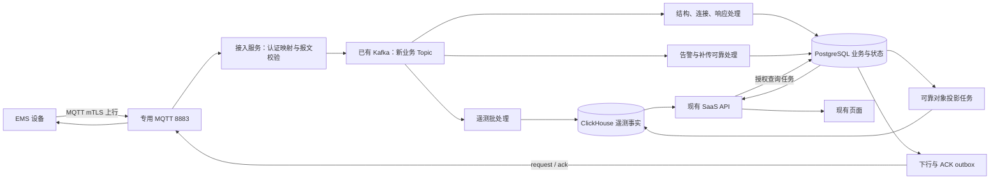

# 云端 EMS 接入与 SaaS 上下行设计方案

日期：2026-09-27。分支：`codex/ems-device-integration`。状态：**待用户确认，尚未实施**。

本方案对应三个交付目标：先形成可审阅的接入方案；确认后实现 EMS 接入和落库；随后真实接通 SaaS 页面涉及的上下行接口。当前只完成资料、源码和基础设施核查，没有修改远端配置、建表、创建 Topic 或下发设备指令。

## 1. 结论与方案选择

建议复用云端已有 Kafka，采用 **EMS → MQTT → 接入服务 → Kafka → PostgreSQL / ClickHouse → 现有 SaaS API**。新增一个独立运行的 `ems-cloud-ingestion` 接入服务，保留现有 Java 21 / Spring Boot API 和 React 前端，不更换脚手架、不重新建立一套租户或资产体系。

| 选择 | 优点 | 局限 | 结论 |
|---|---|---|---|
| MQTT 直接写两种数据库 | 初始组件少 | 数据库故障容易拖住收包；重放、削峰和不同处理速度难以隔离 | 不推荐作为正式链路 |
| MQTT → Kafka → 全部直接写 CH | 可缓冲、批处理 | CH 不能承担下行事务、资产约束和可靠对象冲突处理；Kafka 入队不等于业务对象已保存 | 不推荐 |
| MQTT → Kafka；PG 保存可靠对象和业务关系，CH 保存遥测事实 | 复用已有资源，可靠消息可审计重放，职责明确 | 需要维护幂等、消费进度和发送 outbox | **推荐** |

首期不增加 Flink、Redis 和更多微服务。云端已有这些组件，不代表当前应用必须依赖它们。接入服务内部按协议解析、状态处理、持久化、下行发送分包；同一部署中使用独立工作队列，避免历史补传阻塞告警和 ACK。

## 2. 核查依据与实际缺口

已核读所给目录的 13 个文件：2 份协议/告警方案、点位 SQL、数据库说明和 9 份 JSON。原文件及 SHA256 见 [资料清单](../../ems-integration/source-manifest.json)。原 SQL 仅做离线解析，未执行。

| 已确认事实 | 对实现的影响 |
|---|---|
| SQL 共 1410 个唯一点：普通 295、单体槽位 1000、参数类 115 | 槽位数不是实装设备数；参数名称不代表允许远程写入 |
| 机柜 30 秒/60 秒报文分别 241/54 点，与普通 295 点一致 | 可建立明确的协议定义和类型校验 |
| EMS 6 个运行点、173 个配置项不在该 SQL 中 | 必须分命名空间和字典版本，不能套用 30001 段 |
| SQL 没有单位、读写属性和枚举定义 | 缺失语义标为待映射；不凭字段名猜倍率或控制权限 |
| 版本值是字符串，20062 是四段 U16 数组，存在 null 与质量字段 | 现有 CH 非空 Float64 表和前端 number 类型必须扩展 |
| 同为 sv=1：结构样例为 5×52/26，单体样例为 5×32/16 | 这些文件不能拼成同一 EMS 的一致实机样本；需匹配的真实结构/单体报文 |
| 协议不同章节对告警实施状态有冲突；181 个候选代码不等于全部已启用 | 必须以现场固件版本、启用矩阵和真实报文验收 |
| 当前下行定义主要是 structure.get、alarm.current.get | 可以真实实现查询；策略、启停、功率、参数和升级尚无正式写入契约 |

参考工作簿、枚举源码和 EMS 工程不在本批材料中；没有声称核验过这些内容。详细证据分别见 [协议核查](../../ems-integration/research-protocol.md)、[点位核查](../../ems-integration/research-points.md)、[现有云端映射](../../ems-integration/research-cloud.md)。本方案对冲突处作出明确决策，研究报告中的备选建议不直接构成实施要求。

## 3. 已有云基础设施如何使用

**2026-09-27 23:56 更新：** 用户单独授权先清除旧 Kafka 测试/开发数据。现已删除 16 个旧业务 Topic，消费组和业务分区目录均为 0；Kafka 完成实际生产/消费验证。旧 EMS 接入及遥测 processing/history/state-projection 四个服务已停止并关闭自启动。下述故障与共存说明是方案形成时的快照；实施时采用 [清理后的状态](../../ems-integration/operations/2026-09-27-kafka-cleanup/README.md)，无需再次保留已授权删除的旧 Topic。接入方案本身仍待用户确认。

已只读确认 Kafka 3.9.1 存在，单节点 KRaft，业务地址为 `127.0.0.1:19094`，SASL_SSL；目前元数据查询失败，日志出现 Broker 到 Controller 的心跳超时。**进程运行不等于接入健康**，联调前先定位并恢复可用性。已有 Topic 和消费组清单尚未成功读取，不能宣称不存在或直接覆盖。

Kafka 默认 3 分区、单副本，保留同时受 72 小时和每分区 512 MiB 限制。单副本不能提供主机故障冗余，按容量先触发清理时也不能保证保留 72 小时。新链路使用独立 Topic、消费组和账号，与旧 telemetry/Flink 链路隔离。

正式 MQTT 使用已有专用 8883 mTLS 服务。已发现三项待修正配置：云端身份缺少完整上行消费/ACK 权限；当前 64 KiB 正文上限不足以接收协议允许的 128 KiB alarm_data；当前 ClientID 配置会替换传入值，不能证明错误 ClientID 被拒绝。后者需严格校验钩子或与 EMS 方明确修订身份契约，并做负向测试。[Mosquitto 官方配置说明](https://mosquitto.org/man/mosquitto-conf-5.html)

批准后：先完成备份、依赖清单与影响分析，再调整专用服务。若 Kafka 修复涉及旧业务共享服务重启，先说明具体影响和恢复步骤，不能直接停机试错。旧匿名 1883 不作为生产入口。

业务数据库继续使用本项目独立的 `ems_cloud_v2_proto`、`ems_cloud_v2_proto_telemetry`，不使用早期旧业务库。接入服务部署在云服务器内网侧，避免本机 Kafka advertised listener 导致跨机客户端连接失败。API 继续只读 CH，接入服务使用单独的受限写入身份。

详细现场记录见 [基础设施核查](../../ems-integration/research-infrastructure.md)。本次未改配置、未重启服务。

## 4. 接入数据流

建议仅创建三类输入 Topic，名称在实施前与现存资源查重：

| 拟定 Topic | 内容 | 处理方式 |
|---|---|---|
| ems-cloud-v3.ingress.fast.v1 | 普通点、单体、EMS 运行/配置报文 | CH 批写；配置按 rev 分流到 PG |
| ems-cloud-v3.ingress.state.v1 | heartbeat、status、structure、response、alarm_current | 当前连接与 seq 校验，保存状态/结果 |
| ems-cloud-v3.ingress.reliable.v1 | alarm_event、alarm_data、important_history | PG 完整保存、去重与 ACK 事务 |

消息 key 为 emsId。三类 Topic 之间没有全局顺序保证，因此业务依靠连接代际、结构版本、快照 seq 和查询代际做保护，不能凭到达时间覆盖状态。入口为每条消息记录不可变的云端接收时间、入口实例/序号和消息身份，重放时保持这些原始字段。

Kafka producer 使用显式确认和幂等配置；消费进度在对应持久化成功后提交。Kafka 的事务不能自动使 PostgreSQL、ClickHouse 与 MQTT 成为一个事务，外部落库仍需幂等与 outbox。[Kafka 官方生产者配置](https://kafka.apache.org/39/configuration/producer-configs/)；[Kafka 官方设计说明](https://kafka.apache.org/40/design/design/)

首期每个 EMS 只有一个有效接入所有者，不部署重复通配订阅制造重复状态流；使用 PG 租约及 fencing token 防止双实例同时推进当前状态或发送指令。接管后先等待新鲜心跳，再查询结构和各柜当前告警。未来横向扩容仍按 emsId 固定分配所有者。

普通 QoS0 报文在到达 Kafka 前没有端到端可靠保证。Kafka 不可用时只允许有界缓冲、记录丢弃计数，不承诺恢复从未接收的数据；可靠对象则依赖 EMS 的应用 ACK 重试。当前 EMS 告警 RAM 队列在设备重启后可能丢失，这个边界需对外说明。

## 5. 身份、设备与点位映射

1. 注册 emsId（小写 UUID）并绑定已有 EMS 资产及站点；首期一个 EMS 只属于一个当前站点，一个站点可绑定多个 EMS。租户/客户权限从既有资产关系派生，不接受报文自报的租户或站点。
2. Topic emsId、证书身份、报文 emsId（字段存在时）必须一致。未知身份不自动建立客户、站点或归属。
3. 结构上报只维护该 EMS 授权范围内的设备映射。柜号限定 1—30；公共表计使用独立公共作用域，不伪造柜 0。退出柜保留历史，不物理删除历史资产。
4. SN 是真实设备属性，不是 EMS 接入主键。缺失 SN 保留未知；拟将现有 SN 的必填限制调整为可空且非空值仍全局唯一，禁止生成假 SN。BMU 共享 SN 时共用物理资产身份，位置由布局槽表达，不创建重复 SN 的物理设备。
5. 点定义与测点实例分开：协议版本/字典版本/命名空间/点号决定类型，绑定关系决定资产和现有 measurement_point。单位与聚合语义集中定义，不复制到每个设备实例。
6. ems/cabinet/config 是不同编号空间；结构 sv、配置 cfg.rev、协议/字典版本各有独立含义。禁止因为编号相似就合并。

EMU、BMS、TMS、PVDC、PCS、GRID 的逻辑来源与物理设备不总是一一对应。已确定对应可自动绑定；dcdc/pvdc、bmu/bms、grid 实际表计边界未确定时展示“待映射”，保留源数据，不强行归属。

## 6. PostgreSQL 关系模型与约束

以下为逻辑关系清单，实施时先复用现有等价实体，再编写新增 Flyway 迁移；不修改已经执行的旧迁移，不把资料中的 SQLite 表照搬进 PG。

| 关系组 | 最小关系与关键约束 |
|---|---|
| 接入身份 | ems_gateway：ems_uuid 主键、device_id 唯一外键；绑定有效期单独记录，以防换站后历史授权错误 |
| 当前连接 | 每 EMS 一条 connection_state；保存当前连接、入口代际、最后新鲜心跳、租约/fencing；不复制站点/客户名称 |
| 结构与资产 | structure_revision 以 (EMS,sv) 唯一保存布局；device_binding 记录作用域/角色/局部号与资产及有效期；bmu_layout 记录 BMU 位置和容量 |
| 结构现状 | 单独保存当前 connectionId/seq 与设备元信息现状；同 sv 可以更新 SN、版本、cellReady 等非布局信息，不新增虚假 sv |
| 点定义 | point_definition 以 (catalog_version,namespace,source_id) 唯一，关联测量语义；point_binding 关联源设备位置和现有 measurement_point，禁止一个有效源位置绑定多个测点 |
| 配置快照 | config_revision 以 (EMS,cfg_rev) 唯一；config_value 以 (revision,definition) 唯一；173 项按定义类型保存，预留 null 有别于运行采样失败 |
| 可靠接收 | reliable_message 保存完整对象、规范内容 hash、来源时间与处理状态；按类型的自然键建立唯一约束，保存成功 ACK 与对象在同一事务产生 |
| 重要历史 | history_sample_identity 以 (EMS,柜,源点,归档时间) 唯一，记录无损规范值用于跨任务冲突判断；只覆盖重要补传集合，不为全部实时点在 PG 建热写 EAV |
| 告警业务 | 复用现有 alarm，加 EMS 外部身份映射；事件序列按 (EMS,alarmId,seq) 唯一；当前清单按 (EMS,柜,connectionId,seq) 维护版本与成员，不把历史事件直接作为当前清单 |
| 下行与发送 | query_request 保存被授权查询、连接、截止时间、状态和结果；outbox 保存待发目标/载荷/重试进度，可同时承载查询和保存 ACK，逻辑类型隔离 |

所有业务关系使用明确 PK、FK、UNIQUE、NOT NULL（仅针对必有值）和 CHECK；有界枚举、柜号、序号、时间关系和值类型互斥均校验。跨表的站点一致性和有效期互斥通过复合外键/排他约束或受控事务实现，不只依赖前端。

遵循 3NF：资产决定归属、点定义决定单位/类型、测点实例决定资产绑定，不在子表重复名称和客户等可推导属性。原始报文是协议取证对象，可按完整 JSON/字节保存；它不替代可查询业务关系。规范内容比较拒绝重复 JSON 键，数字使用无损解析，不能经 JavaScript Number 再计算 hash。

ACK/outbox、消费记录和原始证据是运行所需信息，按明确定义的保留期维护，不额外给所有表套用删除标记、备注或冗余 tenant_id。具体 DDL 字段逐项说明用途后纳入迁移审查。

## 7. ClickHouse 时序模型

保留原 measurement_sample 和既有模拟历史，新增版本化事实模型，不把旧数据伪装成 EMS 实测。API 通过明确的来源选择读取，避免同一站点混合模拟与真实值。

- 普通观测：测点 ID、原始消息 ID、源时间（可空）、接收时间、质量、来源类型、值类型和互斥的数值/整数/字符串/U16 数组值槽。20062 保留原顺序四段，不拼成 double；版本字符串不转小数。
- 实时源时间与补传归档时间分开表达，来源时间类型进入去重语义。没有真实采样时间就显示未知，不能用收到时间冒充。补传可补历史曲线，但不能覆盖实时快照或无损实时位图。
- 单体使用独立整组数组事实，保存 EMS/柜/布局版本/种类/时间与二维数组；额外使用整体存在标记区分 values=null 和个别元素 null，不假设 ClickHouse 支持 Nullable(Array)。BMU/槽位置从布局解释，保留 null 位置。
- 只对匹配的已知 sv 且 cellReady 有效的数据生成可查询单体事实。未知 sv 或长度冲突保留有界原始证据、触发 structure.get，跳过当前报文解码；不在以后用另一个布局回填成当时实况。
- CH 重试使用稳定事实身份，批次重放不产生新 revision。查询需正确处理尚未合并的重复行；不能仅依赖后台 ReplacingMergeTree 最终合并就声称业务恰好一次。

实时流在 CH 批写成功后提交 Kafka 消费进度；可靠流先写 PG，由投影任务批写 CH 并记录投影完成。CH 故障不丢已 ACK 的可靠对象；恢复后按保存对象重建投影。

最新值保留 value、quality、sourceTime、receivedAt 和 stale 原因，null 不补零。历史聚合按语义限定：连续量 avg/min/max/last；状态、字符串、位图取末值或变化；累计电量做有复位/回绕规则的 delta。不能继续对全部点统一 avg(value)。

## 8. 告警、补传与 ACK 的确切规则

| 类型 | 幂等自然键 | 保存成功 ACK |
|---|---|---|
| alarm_event | EMS + alarmId + seq | v、type、alarmId、seq |
| alarm_data | EMS + alarmId | v、type、alarmId、seq:null |
| important_history | EMS + taskId + part | v、type、taskId、part |

一次 PG 事务完成对象校验、完整保存、去重/冲突检查和 ACK outbox 写入；提交后才发送 ACK。MQTT PUBACK、Kafka 已入队和开始写数据库均不代表保存成功。相同自然键、相同规范内容重发成功 ACK；相同键不同内容拒绝覆盖并按协议返回 rejected。短暂不可用可以返回 busy；不得先确认后丢弃。

重要补传还要跨 taskId 校验同一源历史样本。发现不同值时整包回滚并报告冲突，不半写后 ACK。原始历史来自 REAL、精度已损失的宽位图不承诺可恢复。协议只有任务/包序号，没有完整断线区间和缺口证明，因此页面显示收到/保存/投影包数与异常，不声称“历史恢复 100%”。

告警历史与当前告警分开：alarm_event 入历史并触发清单刷新；当前告警仅由当前连接的新 seq 清单更新。alarms=null 是未知，[] 才是已确认无告警。查询期间收到新事件必须保留下一次刷新需求，不能用较早查询完成覆盖。

SaaS 中的“人工确认告警/处理工单”只写业务处理记录，与协议“已可靠保存”的 ACK 完全不同。alarm_data 的候选点 900001/900002 是占位，不注册成真实点。真实关联点绑定、EMS 持久冻结与发送能力需在实机启用前确认。

## 9. 在线、重连和实时展示

90 秒内没有新鲜 heartbeat，标记“EMS 通信不可达”，不直接判定设备停机或故障。子设备 link.online 的 true/false/null 分别为在线/离线/未知；不沿用现有 15 分钟资产观测规则冒充 EMS 心跳规则。

connectionId 是随机 UUID，不能比较大小判断新旧。当前连接切换依据有效入口所有者观察的新鲜心跳与入口顺序；同一入口代际内已退役连接不再接管，重放保留原始接收时刻。入口重启后不拿旧 Kafka 心跳恢复“在线”，先获取新鲜心跳；来源代际不确定时显示未知并主动查询。不得让晚到旧结构、旧查询结果或旧连接心跳覆盖现状。

前端先采用实际可控的定时刷新：可见实时页默认 10 秒、后台页暂停，取消过期请求并忽略旧响应；查询状态短周期轮询直到终态。返回值带快照时间和质量，刷新按钮触发实际获取。无需首期加入 WebSocket。

站点功率/SOC 等必须经已确认点映射与公式生成；缺失时显示未知或明确覆盖率。SOC 只有容量已知才按容量加权，不能简单平均模拟出站点值；电量、收益和结算不能仅凭有遥测就推导完成。

## 10. 下行接口与权限

新增请求采用当前连接绑定：`{v,emsId,connectionId,id,op,expiresAtMs,params}`。默认有效期 30 秒；发送前重查连接与权限，过期/换连接则终止，不能在新连接自动补发旧请求。请求 ID 全局唯一；重发必须保持原内容与截止时间。响应保存并与原 EMS、请求、操作及连接上下文匹配。

首期实际支持：`structure.get`（空参数）、`alarm.current.get`（授权范围内柜号 1—30）；旧 `communication.status.get` 只在显式兼容配置下启用，不代替新协议。遵守单连接 32 次/60 秒、队列上限及 BUSY 处理。超时表示结果未知，不能显示设备已执行或自动转换为新控制请求。

以下为拟新增/扩展的 API，实施时统一沿用仓库已有路由前缀和响应封装：

| API 逻辑路径 | 功能/授权 |
|---|---|
| GET /stations/{id}/ems | 已绑定 EMS 与通信状态；站点范围 + ems.read |
| POST /stations/{id}/ems-bindings | 显式注册绑定；ems.manage，校验资产归属 |
| GET /ems/{id}/structure | 当前结构、版本和未知原因；ems.read |
| GET /ems/{id}/configuration | 生效配置快照及待映射说明；ems.read，无写入含义 |
| POST /ems/{id}/queries | 操作白名单、schema、限流与审计；ems.query |
| GET /ems/{id}/queries/{requestId} | 查询状态/结果；每次读取重新检查站点授权 |
| GET /ems/{id}/ingestion-status | 消费延迟、最近保存/投影、补传异常；运维授权 |
| GET /stations/{id}/telemetry/latest | 页面所需最新测点值、质量和源时间；telemetry.read |
| GET /devices/{id}/cells | 按布局读取电压/温度，支持真实空态；telemetry.read |
| 现有 /points/{id}/history 等 | 保持兼容，增加类型/质量/来源与合法聚合方式 |

新增权限进入既有权限目录；给超级管理员配置全部本轮可用权限，其他角色依授权范围分配。菜单可见不代表拥有接口权限。设备侧 ACK 身份属于服务权限，不暴露给普通用户页面。

**写控制仍属于完整目标的后续工作，不以只读查询冒充上下行全部完成。** 当前协议没有策略下发、参数修改、启停、功率设定、复位、XML 部署和固件升级的合法操作定义。这些按钮继续显示未接通；下一阶段须补齐操作名、参数/单位/范围、前置状态、连接和截止时间、幂等/重放策略、接受/执行/生效三阶段结果、失败码、撤销与审计契约，并由 EMS 实现后真实联调。不能根据点位 SQL 自行发明写命令。

## 11. SaaS 01—08 接通范围

| 模块 | 本轮接通内容 | 不能由本协议直接获得的内容 |
|---|---|---|
| 01 总览 | EMS 在线、真实功率/SOC、告警摘要、数据新鲜度和覆盖率 | 缺少映射/容量时的估算值 |
| 02 资产与站点 | EMS/柜/设备树、最新点、单体、配置只读、结构/告警主动查询 | 建站部署执行、设备参数写入 |
| 03 运营中心 | 遥测支撑的运行状态、能量曲线；区分计划与实际 | 策略执行、外部电价与结算事实 |
| 04 运维中心 | 通信状态、当前/历史告警、已上报故障关联数据、补传状态 | 未上报诊断/健康评分、升级执行 |
| 05 工单与审批 | 告警关联和现有人工处理流程 | 审批通过自动等于 EMS 已执行 |
| 06 分析与报告 | 按点类型/质量/来源的真实曲线与统计 | 无法从当前消息推导的收益和结算 |
| 07 平台管理 | EMS 绑定、访问范围、接入查询权限、操作审计 | 无授权的自动建租户/客户/站点 |
| 08 设置 | 展示可查询生效配置，保留个人/平台设置语义 | 以平台设置冒充 EMS 写配置 |

各模块优先沿用现有布局与 API；本方案不宣称已重新核对 Figma。实施涉及页面视觉变化时，按 AGENTS.md 先读取对应最新节点与截图，重复设计优先“克制风格”。

## 12. 容量、保留与故障恢复

实算普通点负载为 `241×2880 + 54×1440 = 771840` 槽/柜/日；30 柜为 23155200 槽/日。单体按数组保存可减少行数，但元素存储量仍存在；匹配结构样例的 390 槽另增加 561600 槽/柜/日，不能与 240 槽的另一份样例混用。当前磁盘空闲快照约 37 GiB，不能承诺任意站数和永久保存。

建议以两个现有站点作为验收范围，先确认实际柜数和布局，完成 24 小时实测后确定正式保留配置。初始目标：Kafka 回放 72 小时（同时按实测容量调整字节限额）；CH 原始细粒度历史目标 30 天；业务资产/配置/告警按业务保留。上述是待压测验证的目标，不在未核定容量前直接启用破坏性 TTL。

PG 可靠对象在 CH 投影成功且备份可恢复前不清除。后续清理需要明确可接受重试/重放时限，保留对应自然键和 hash；重要历史跨任务冲突索引覆盖相同接收窗口。超过受支持窗口的报文必须显式拒绝/人工处理，不能删除去重记录后又当新对象 ACK。具体期限需与 EMS 补传保留能力共同冻结。

监控至少包括 MQTT 连接、未知身份/类型、非法报文、Kafka lag、PG/CH 写入延迟、ACK 延迟/积压、下行超时、重复/冲突、结构不匹配、入口丢包和磁盘。可靠消息处理以正常负载下 2 秒内产生 ACK 为验收目标，并验证 10 秒 ACK 超时下无重复副作用；不能将目标写成已达到指标。

单机 PG/Kafka/CH 同时失效不在本方案的高可用保证内。要承诺节点级 RPO/RTO，还需独立备份恢复演练或增加节点；首期报告实际恢复结果，不宣称零丢失。

## 13. 批准后的实施与验收顺序

| 阶段 | 交付与验收门槛 |
|---|---|
| A：联调基础 | 取得 Kafka 健康与现有资源清单；专用 MQTT 身份/ACL/限额；真实 EMS UUID 和固件能力；两站点授权绑定；不接旧业务库 |
| B：协议与数据 | 冻结字典 profile、迁移约束、解析器及类型模型；资料样例仅作为独立用例，另取一致实机样包；未知语义不得猜测 |
| C：上行与落库 | MQTT/Kafka 接入、普通/单体/结构/配置、可靠对象与 ACK、CH 投影；用故障注入证明去重、重试与恢复 |
| D：API 与页面 | 最新值、历史、告警、单体、配置、主动查询、授权与空态；逐页核对 01—08 使用真实接口和刷新 |
| E：实机验收 | 两站点接入、断线重连、补传、告警、查询响应与至少 24 小时容量测量；明确 EMS 尚不支持的类型 |
| F：写控制闭环 | 补齐并确认 EMS 写操作契约，再实现对应 API、权限、审批/发送/执行结果和实机验收；未通过不得开放按钮 |

核心自动化/集成用例：真实 0 与 null；valid/stale/invalid；字符串版本和四段位图无损；同键同值重复/同键异值整包拒绝；PG 已提交但 ACK 未发时崩溃；CH 停止后恢复；旧 Kafka 心跳不得使站点上线；新连接不得被旧 seq 覆盖；未知 sv/错误数组尺寸；当前告警 null 不清空；查询期间新事件保留刷新；跨站越权、权限撤销后的轮询；错误证书/ClientID/Topic；报文边界大小；过期/换连接请求不发送。

测试报告区分解析样例、模拟器联调、云端基础设施实测和 EMS 实机验收。前两种通过不能作为真实设备已接通的证据。提交迁移前做空库与现有库升级验证，确认未改变旧库/旧 Topic；回滚优先关闭新消费者/接口功能开关，保留接收证据，不删除已收数据。

## 14. 本次待确认事项

建议批准以上架构与分阶段实施范围：复用 Kafka、独立接入服务、PG 可靠保存和 CH 时序投影，先完成当前协议支持的上行及查询，再按正式写契约完成控制闭环。

实施输入中优先需要真实 EMS 的固件版本/启用矩阵、emsId 与两站点对应关系，以及匹配的结构/单体报文。可从已授权系统只读取得的资料先自行核实；无法取得的部分再集中向用户或 EMS 方索取。点位工作簿、待定单位/枚举、写控制契约缺失时，相应语义和操作保持未确认，不阻塞其余已明确链路的开发。

下一步仅在用户确认本方案后编写详细实施计划并开始代码、迁移和专用基础设施调整。保留当前工作树已有前端修改，本方案不包含或覆盖这些改动。
